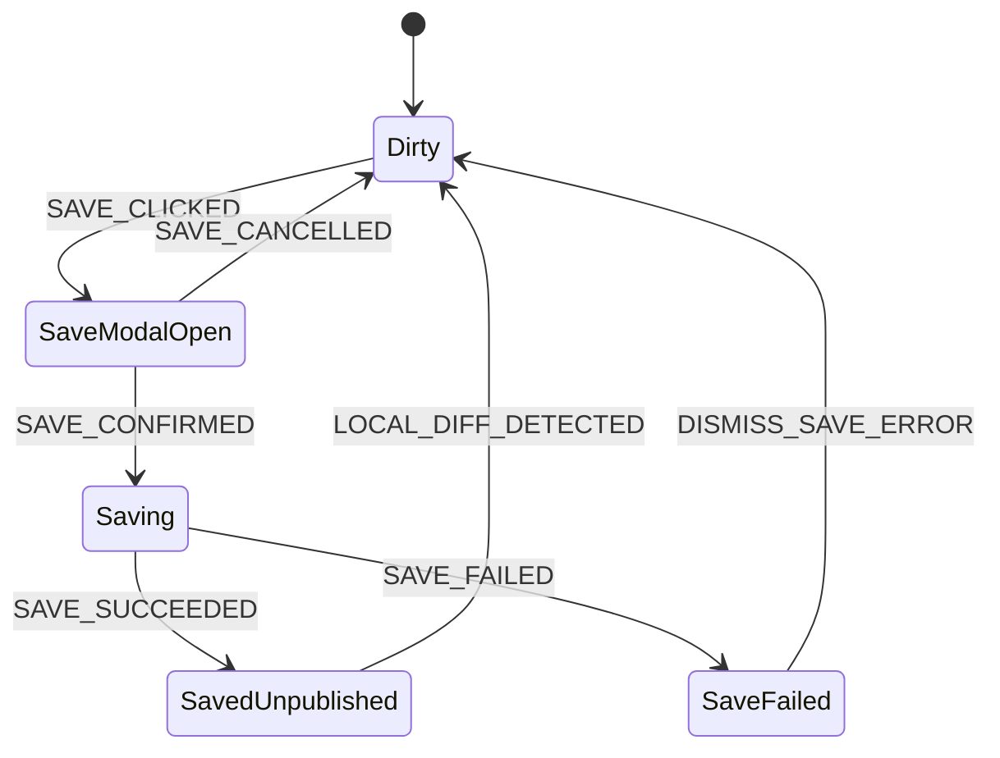
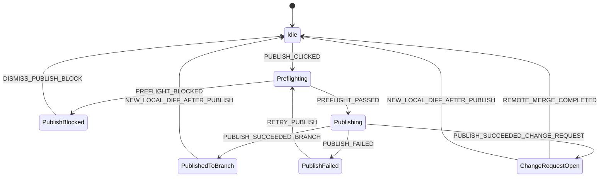
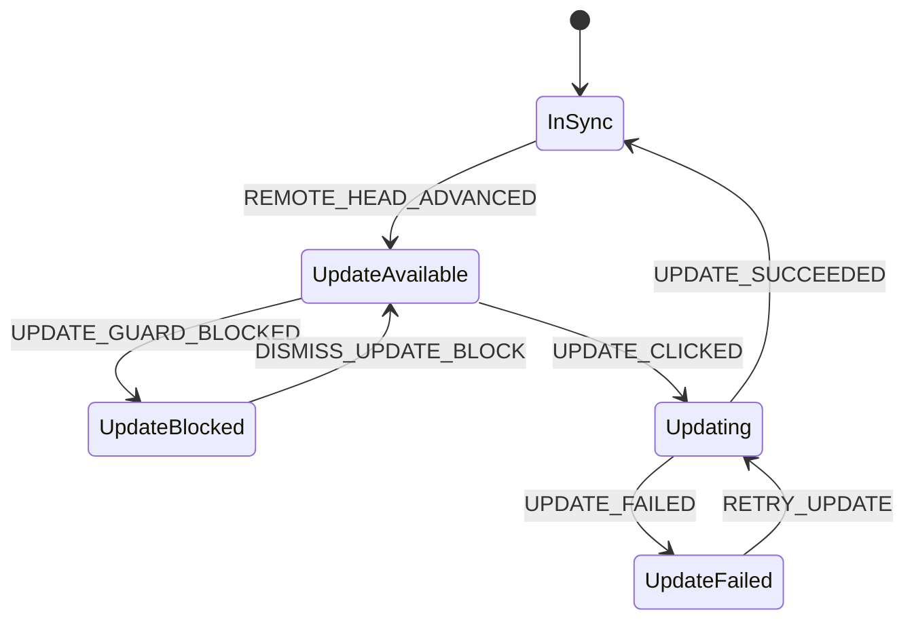

# Gableton Core Action State Machine

**Date:** March 18, 2026  
**Status:** Draft  
**Audience:** Product, design, desktop client engineering, backend engineering

## 1. Purpose

Define the authoritative behavior for the three primary user actions in Phase 1:

- `Save version`
- `Publish changes`
- `Update project`

This spec fixes the allowed states, transitions, guard conditions, and blocking rules so UI design and implementation do not drift.

Related specs:

- [product-ux-spec.md](/Users/hunterwiley/Code-Projects/Gableton/docs/product-ux-spec.md)
- [phase0-to-phase1-migration-spec.md](/Users/hunterwiley/Code-Projects/Gableton/docs/phase0-to-phase1-migration-spec.md)

## 2. Scope

In scope:

- project workspace state visible in the desktop app
- button enablement and blocking rules
- save, publish, and update transitions
- environment and conflict interactions

Out of scope:

- realtime collaboration
- reviewer approval state machine after a change request already exists
- timeline-level semantic merge details

## 3. Modeling Approach

The desktop app should treat project state as one root machine with parallel regions.

Root machine:

- `booting`
- `ready`
- `fatal_error`

Parallel regions inside `ready`:

- `scan`
- `local_version`
- `sync`
- `publish`
- `environment`
- `mutation_lock`

This is preferable to one giant flat machine because the UI needs to combine independent signals:

- the workspace may be dirty while the project is also behind remote
- the user may have a saved local version while a plugin warning exists
- the app may allow publish while disallowing update

## 4. Context

The machine context should carry at least:

- `workspacePath`
- `projectId`
- `activeLine`
- `workspaceBaseCommitId`
- `remoteHeadCommitId`
- `latestSavedLocalVersionId`
- `latestPublishedVersionId`
- `activeChangeRequestId`
- `scanRevision`
- `hasUnsavedLocalChanges`
- `hasSavedUnpublishedVersion`
- `hasUpdateAvailable`
- `environmentWarnings[]`
- `environmentBlocks[]`
- `overlapRisk`
- `abletonOpen`

## 5. Root Machine

### 5.1 Root states

- `booting`
  - entry: load workspace metadata, detect Ableton state, start initial scan
- `ready`
  - steady state with parallel regions active
- `fatal_error`
  - unrecoverable workspace issue such as corrupt metadata or unreadable workspace

### 5.2 Root transitions

- `APP_OPENED` -> `booting`
- `BOOT_SUCCEEDED` -> `ready`
- `BOOT_FAILED` -> `fatal_error`
- `RETRY_BOOT` from `fatal_error` -> `booting`

## 6. Parallel Regions

### 6.1 Scan region

States:

- `idle`
- `scanning`
- `scan_failed`

Transitions:

- `START_SCAN` from `idle` -> `scanning`
- `FILES_CHANGED` from `idle` -> `scanning`
- `SCAN_SUCCEEDED` from `scanning` -> `idle`
- `SCAN_FAILED` from `scanning` -> `scan_failed`
- `RETRY_SCAN` from `scan_failed` -> `scanning`

Rules:

- `Save version` is blocked while `scan=scanning`.
- `Publish changes` is blocked while `scan=scanning`.
- `Update project` is allowed only if it does not depend on a pending local scan result.

### 6.2 Local version region

States:

- `clean`
- `dirty`
- `save_modal_open`
- `saving`
- `saved_unpublished`
- `save_failed`

Interpretation:

- `clean`: workspace matches current base and has no unsaved local changes
- `dirty`: local changes exist and are not yet saved as a version
- `saved_unpublished`: latest local state has been saved but not yet published

Transitions:

- `LOCAL_DIFF_DETECTED` from `clean` -> `dirty`
- `LOCAL_DIFF_DETECTED` from `saved_unpublished` -> `dirty`
- `SAVE_CLICKED` from `dirty` -> `save_modal_open`
- `SAVE_CANCELLED` from `save_modal_open` -> `dirty`
- `SAVE_CONFIRMED` from `save_modal_open` -> `saving`
- `SAVE_SUCCEEDED` from `saving` -> `saved_unpublished`
- `SAVE_FAILED` from `saving` -> `save_failed`
- `DISMISS_SAVE_ERROR` from `save_failed` -> `dirty`
- `UPDATE_SUCCEEDED_WITH_NO_LOCAL_DIFF` from any local state -> `clean`
- `PUBLISH_SUCCEEDED_WITHOUT_NEW_LOCAL_DIFF` from `saved_unpublished` -> `clean`

Rules:

- `dirty` means the workspace is not safely checkpointed.
- `saved_unpublished` means work is safe locally but not yet shared.
- Once new file changes occur after a save, the state returns to `dirty`.

### 6.3 Sync region

States:

- `in_sync`
- `update_available`
- `updating`
- `update_blocked`
- `update_failed`

Transitions:

- `REMOTE_HEAD_ADVANCED` from `in_sync` -> `update_available`
- `UPDATE_CLICKED` from `update_available` -> `updating`
- `UPDATE_GUARD_BLOCKED` from `update_available` -> `update_blocked`
- `UPDATE_SUCCEEDED` from `updating` -> `in_sync`
- `UPDATE_FAILED` from `updating` -> `update_failed`
- `DISMISS_UPDATE_BLOCK` from `update_blocked` -> `update_available`
- `RETRY_UPDATE` from `update_failed` -> `updating`

Rules:

- `update_available` means remote approved work exists that is not applied locally.
- `update_blocked` means an update exists but local conditions make it unsafe to apply.

### 6.4 Publish region

States:

- `idle`
- `preflighting`
- `publishing`
- `published_to_branch`
- `change_request_open`
- `publish_blocked`
- `publish_failed`

Transitions:

- `PUBLISH_CLICKED` from `idle` -> `preflighting`
- `PREFLIGHT_BLOCKED` from `preflighting` -> `publish_blocked`
- `PREFLIGHT_PASSED` from `preflighting` -> `publishing`
- `PUBLISH_SUCCEEDED_BRANCH` from `publishing` -> `published_to_branch`
- `PUBLISH_SUCCEEDED_CHANGE_REQUEST` from `publishing` -> `change_request_open`
- `PUBLISH_FAILED` from `publishing` -> `publish_failed`
- `DISMISS_PUBLISH_BLOCK` from `publish_blocked` -> `idle`
- `RETRY_PUBLISH` from `publish_failed` -> `preflighting`
- `REMOTE_MERGE_COMPLETED` from `change_request_open` -> `idle`
- `NEW_LOCAL_DIFF_AFTER_PUBLISH` from `published_to_branch` -> `idle`
- `NEW_LOCAL_DIFF_AFTER_PUBLISH` from `change_request_open` -> `idle`

Rules:

- `idle` means no in-flight publish action.
- `change_request_open` is a published state, not a local dirty state.
- publish state does not replace local version state; both must be considered together.

### 6.5 Environment region

States:

- `healthy`
- `warning`
- `blocking`

Transitions:

- `ENV_HEALTHY` -> `healthy`
- `ENV_WARNING` -> `warning`
- `ENV_BLOCKING` -> `blocking`

Examples:

- warning:
  - plugin missing but merge policy allows warning
  - Ableton version mismatch with no hard policy block
- blocking:
  - required sample missing from workspace
  - unreadable project file
  - policy-blocked compatibility failure

### 6.6 Mutation lock region

States:

- `unlocked`
- `ableton_open`
- `filesystem_busy`

Transitions:

- `ABLETON_DETECTED_OPEN` -> `ableton_open`
- `ABLETON_DETECTED_CLOSED` -> `unlocked`
- `WORKSPACE_MUTATION_STARTED` from `unlocked` -> `filesystem_busy`
- `WORKSPACE_MUTATION_FINISHED` from `filesystem_busy` -> `unlocked`

Rules:

- `Update project` and `Restore version` are blocked when `mutation_lock != unlocked`.
- `Save version` may be allowed while Ableton is open if scan has completed and files are stable.
- `Publish changes` does not require mutation lock because it does not rewrite the workspace.

## 7. Effective UI Status

The UI needs one headline status even though the machine has parallel regions.

Status precedence from highest to lowest:

1. `Conflict requires attention`
2. `Missing sample`
3. `Missing plugin` when blocking
4. `Workspace scan still in progress`
5. `Update available`
6. `Changes not saved`
7. `Version saved locally`
8. `Ready to publish`
9. `Review required`
10. `Up to date`

Derived status rules:

- show `Conflict requires attention` if `publish=publish_blocked` due to overlap risk or merge conflict
- show `Missing sample` if `environment=blocking` and sample issue exists
- show `Update available` if `sync=update_available` or `sync=update_blocked`
- show `Changes not saved` if `local_version=dirty`
- show `Version saved locally` if `local_version=saved_unpublished` and publish has not started
- show `Ready to publish` if `local_version=saved_unpublished` and publish action is enabled
- show `Review required` if `publish=change_request_open`

## 8. Button Enablement

### 8.1 Save version

Enabled when:

- `local_version=dirty`
- `scan=idle`

Disabled when:

- `scan=scanning`
- `scan=scan_failed`
- `local_version` is not `dirty`

### 8.2 Publish changes

Enabled when:

- `local_version=saved_unpublished`
- `scan=idle`
- `environment != blocking`

Disabled when:

- no saved unpublished version exists
- scan is in progress or failed
- environment is blocking
- publish is already in flight

### 8.3 Update project

Enabled when:

- `sync=update_available`
- `mutation_lock=unlocked`
- `local_version != dirty`

Disabled when:

- no update exists
- workspace mutation lock is active
- unsaved local changes exist
- update is already in flight

## 9. Save Version Action Machine

### 9.1 Guards

- `canOpenSaveModal`: `local_version=dirty`
- `canConfirmSave`: message present and `scan=idle`

### 9.2 Entry actions

On `SAVE_CONFIRMED`:

- freeze current scan result
- generate version summary
- persist local version metadata
- mark `hasSavedUnpublishedVersion=true`

### 9.3 Failure cases

- local metadata write failure
- scan revision changed during save
- workspace files became unreadable

User-facing error:

- `Version could not be saved. Try again after the workspace finishes updating.`

## 10. Publish Changes Action Machine

### 10.1 Preflight checks

Required:

- `local_version=saved_unpublished`
- `scan=idle`
- `environment != blocking`
- base commit known

Warnings:

- remote head advanced since last update
- plugin warning present
- overlap risk detected

Blocking conditions:

- unsaved local changes
- no saved version to publish
- required assets missing
- mutation of saved version summary no longer matches current scan revision
- publish conflict that requires manual resolution

### 10.2 API sequence

On `PREFLIGHT_PASSED`:

1. generate object inventory
2. check missing objects
3. upload missing objects
4. stage commit
5. finalize commit
6. if target line is protected, create change request
7. otherwise move target ref directly

### 10.3 Success outcomes

- direct publish:
  - set `latestPublishedVersionId`
  - clear `hasSavedUnpublishedVersion`
- change request:
  - store `activeChangeRequestId`
  - clear `hasSavedUnpublishedVersion`
  - show `Review required`

### 10.4 Failure cases

- remote ref race
- upload failure
- preflight detects stale base
- server rejects commit due to missing objects

User-facing errors:

- `Main changed while you were publishing. Update and try again.`
- `Your changes overlap with newer work and need manual resolution.`
- `Publishing failed before your changes were shared. Your saved version is still safe locally.`

## 11. Update Project Action Machine

### 11.1 Guards

- `canUpdate`:
  - `sync=update_available`
  - `mutation_lock=unlocked`
  - `local_version != dirty`

Blocking reasons:

- unsaved local changes exist
- Ableton currently has the project open
- filesystem mutation is already in progress

### 11.2 Entry actions

On `UPDATE_CLICKED`:

1. fetch manifest for target commit
2. determine missing blobs/chunks
3. sign downloads
4. download missing objects
5. verify hashes
6. apply workspace mutation
7. trigger post-update scan

### 11.3 Success outcome

On `UPDATE_SUCCEEDED`:

- `workspaceBaseCommitId = remoteHeadCommitId`
- local workspace contents reflect latest approved state
- if no local diff remains, set `local_version=clean`

### 11.4 Failure cases

- download failure
- hash verification failure
- workspace write failure
- Ableton re-opened during mutation

User-facing errors:

- `Project update failed before completion. Your previous local version was not replaced.`
- `The downloaded project data could not be verified. Try again.`

## 12. Cross-Region Transition Rules

These transitions synchronize regions:

- `SCAN_SUCCEEDED` with no local diff:
  - `local_version -> clean`
- `SCAN_SUCCEEDED` with local diff:
  - `local_version -> dirty`
- `SAVE_SUCCEEDED`:
  - `publish -> idle`
- `PUBLISH_SUCCEEDED_BRANCH`:
  - `sync -> in_sync` if publishing to current active line
- `REMOTE_HEAD_ADVANCED` while `local_version=dirty`:
  - keep `local_version=dirty`
  - set `sync=update_available`
- `UPDATE_SUCCEEDED`:
  - force `publish -> idle` if no active change request remains

## 13. Conflict and Warning Semantics

### 13.1 Overlap risk

`overlapRisk` is a warning until publish preflight proves it is blocking.

Behavior:

- warning state may still allow `Save version`
- warning state may still allow `Publish changes` to enter preflight
- if preflight confirms conflict, transition `publish -> publish_blocked`

### 13.2 Missing plugin

Missing plugins do not automatically block save.

Behavior:

- allow `Save version`
- allow `Publish changes` if project policy permits warnings
- block merge or publish only if policy requires exact environment parity

### 13.3 Missing sample

Missing required samples are blocking.

Behavior:

- allow user to inspect issue
- block `Publish changes`
- block merge readiness

## 14. Event Definitions

Core external events:

- `APP_OPENED`
- `FILES_CHANGED`
- `REMOTE_HEAD_ADVANCED`
- `ABLETON_DETECTED_OPEN`
- `ABLETON_DETECTED_CLOSED`

Core user events:

- `SAVE_CLICKED`
- `SAVE_CANCELLED`
- `SAVE_CONFIRMED`
- `PUBLISH_CLICKED`
- `UPDATE_CLICKED`
- `DISMISS_SAVE_ERROR`
- `DISMISS_PUBLISH_BLOCK`
- `DISMISS_UPDATE_BLOCK`
- `RETRY_PUBLISH`
- `RETRY_UPDATE`

Core async result events:

- `SCAN_SUCCEEDED`
- `SCAN_FAILED`
- `SAVE_SUCCEEDED`
- `SAVE_FAILED`
- `PREFLIGHT_PASSED`
- `PREFLIGHT_BLOCKED`
- `PUBLISH_SUCCEEDED_BRANCH`
- `PUBLISH_SUCCEEDED_CHANGE_REQUEST`
- `PUBLISH_FAILED`
- `UPDATE_SUCCEEDED`
- `UPDATE_FAILED`

## 15. Acceptance Criteria

This machine is acceptable when:

1. `Save version`, `Publish changes`, and `Update project` can each be enabled or blocked deterministically from machine state.
2. The app never overwrites unsaved local changes.
3. Publishing failure never destroys the saved local version.
4. A single top status label can be derived consistently from the parallel regions.
5. Engineering can map publish and update transitions directly onto existing API endpoints.

## 16. Recommended Implementation Shape

Recommended approach:

- one project-scoped state machine instance per open workspace
- explicit typed events
- derived selectors for:
  - headline status
  - button enablement
  - blocking reason text
  - warning badges

Do not implement this behavior as scattered boolean flags in UI components. The UX will drift and unsafe edge cases will appear.
